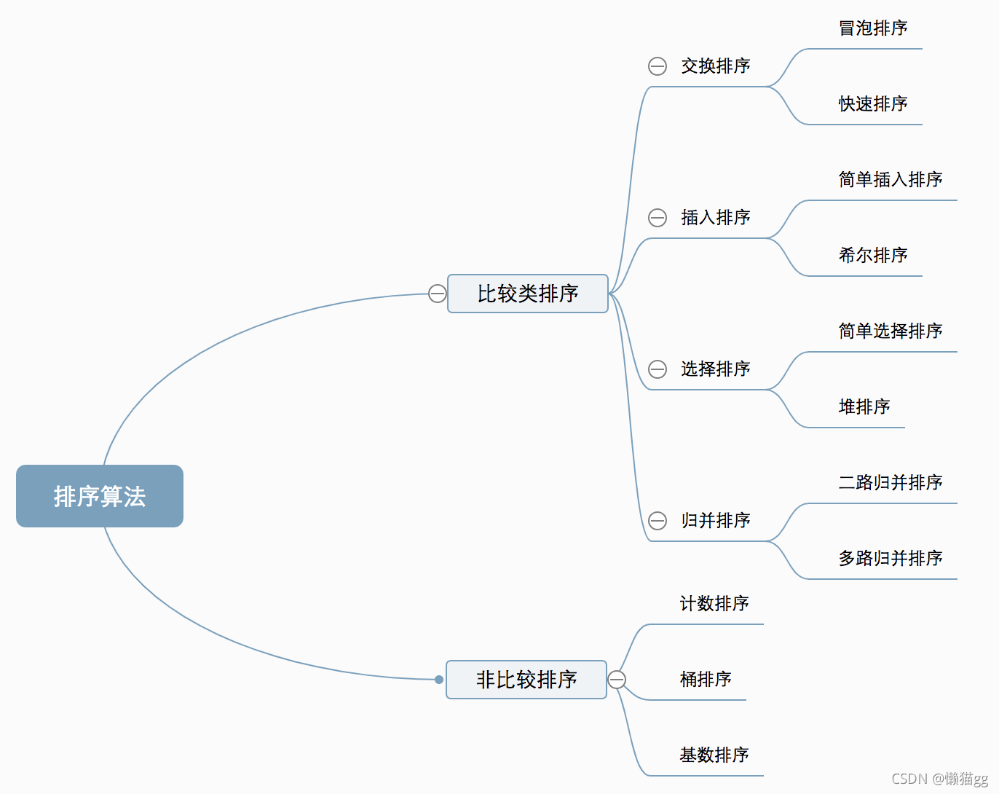

**排序**是数据结构与算法中的一个重要问题。根据排序问题的规模，即待排序的数据能否全部放到内存里，排序问题可以分为**内排序**和**外排序**。本文主要关注**内排序**，即问题规模较小，待排序的所有数据可以全部置于内存中。
> 10亿个数，一台内存2G的计算机，找出前1000大的数。这就是典型的外排序问题。



## 算法评价
**时间复杂度**、**空间复杂度**、**算法稳定性**，这三者是评价内排序算法的主要指标。
- 时间复杂度：执行算法所需要的时间，通常用**大O表示法**描述。
- 空间复杂度：除待排序数据本身所占空间外，算法需要占用的**额外内存空间**。
- 算法稳定性：主关键字相同的两个数据，排序后先后次序不变则称该算法稳定，否则称为不稳定排序算法。
> 算法稳定性举例：
> - 原数据：[A1,A2,A3]={1,3,1};
> - 稳定算法排序后：[A1,A3,A2]={1,1,3};
> - 不稳定算法排序可能出现：[A3,A1,A2]={1,1,3};
> - 虽然排序后都是{1,1,3}，但是原数据中A1=A3，且A1相对A3在前；经过不稳定排序后，可能出现A1和A3的相对顺序发生变化的情况；而稳定排序可以保证排序后A1仍相对A3在前。

## 冒泡排序
冒泡排序是一种典型的**交换排序**。

算法原理：
- 比较相邻的元素。如果第一个比第二个大，就交换它们两个；
- 对每一对相邻元素做同样的工作，从开始第一对到结尾的最后一对。这一步结束后，排在最后的元素会是所有数据中最大的数；
- 针对所有的元素重复以上的步骤，除了最后一个；
- 持续每次对越来越少的元素重复上面的步骤，直到没有任何一对数字需要比较。

冒泡排序基本代码如下：
```c++
void BubbleSort(vector<int>& nums){
    const int size = nums.size();
    for(int i = 0; i < size-1; ++i)
        for(int j = 0; j < size-1-i; ++j)
            if(nums[j] > nums[j+1])
                swap(nums[j], nums[j+1]);
}
```
性能评价：
- 当`nums[j] == nums[j+1]`时，我们并不交换它们。所以冒泡排序是稳定的;
- 共循环了(n-1)+(n-2)+...+2+1=n(n-1)/2,所以时间复杂度是O(n^2)。

## 简单选择排序

基本思想：首先在未排序数据找到最小的数，然后把该最小数放到排序序列的末尾，直到所有数据排序完毕。

其实现代码如下：
```c++
void SelectionSort(vector<int>& nums){
    const int size = nums.size();
    for(int i = 0; i < size-1; ++i){
        int minIndex = i;
        for(int j = i+1; j < size; ++j)
            if(nums[j] < nums[minIndex])
                minIndex = j;
        swap(nums[i], nums[minIndex]);
    }
}
```

性能评价：
- 简单选择排序是**不稳定**排序；
- 无论什么数据进去，它的比较次数都是n(n-1)/2,所以时间复杂度是O(n^2)。

## 简单插入排序

基本思想：将待排序数据看成由**已排序**和**未排序**两部分组成。对于未排序数据，在已排序序列中从后向前扫描，找到相应位置并插入。

算法流程：
1. 从第一个元素开始，该元素可以认为已经被排序；
2. 取出下一个元素，在已经排序的元素序列中从后向前扫描；
3. 如果该元素（已排序）大于新元素，将该元素移到下一位置；
4. 重复步骤3，直到找到已排序的元素小于或者等于新元素的位置；
5. 将新元素插入到该位置后；
6. 重复步骤2~5。

其实现代码如下：
```c++
void InsertSort(vector<int>& nums){
    const int size = nums.size();
    for(int i = 1; i < size; ++i){
        int curr = nums[i];
        int j = i - 1;
        while(j >= 0 && curr < nums[j]){
            nums[j+1] = nums[j];
            --j;
        }
        nums[j+1] = curr;
    }
}
```

性能评价：
- 插入排序是稳定的。
- 时间复杂度为O(n^2)。

## 二路归并排序
归并排序其实就是二叉树的后序遍历

## 快速排序

特点：
- 原地排序
- NlgN